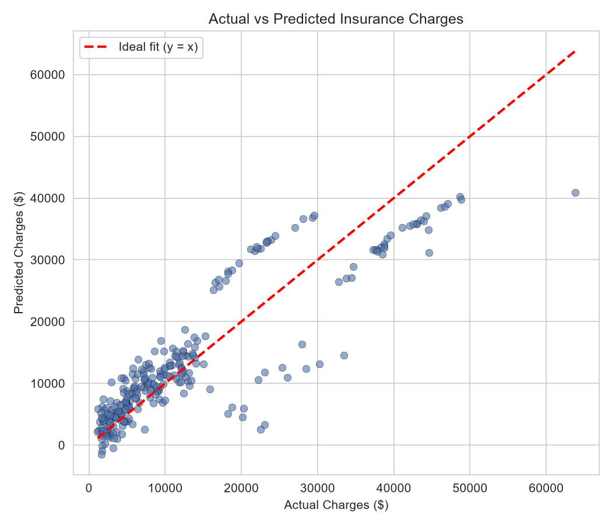

# Medical Insurance Cost Prediction using Multiple Linear Regression

**AI-ML Assignment 1**
**Name:** Adit Singh Rathore
**Registration Number:** 23BCE10238

## Objective

An insurance company wants to estimate the medical insurance charges of customers based on
their personal and health-related information. This project builds a **Multiple Linear
Regression** model to predict insurance `charges` using six features: age, sex, BMI, number of
children, smoker status, and region.

## Dataset Link

[Medical Cost Personal Insurance Dataset – Kaggle](https://www.kaggle.com/datasets/mirichoi0218/insurance)

> The dataset (`insurance.csv`) is **not** included in this repository — download it from the
> Kaggle link above and place it in the project root before running the notebook.

## Libraries Used

- `pandas` – data loading and manipulation
- `numpy` – numerical operations
- `matplotlib`, `seaborn` – visualization
- `scikit-learn` – train/test split, Linear Regression model, evaluation metrics

## Methodology

1. **Data Understanding** – Loaded the dataset with Pandas, inspected the first five records,
   and identified numerical features (`age`, `bmi`, `children`), categorical features (`sex`,
   `smoker`, `region`), and the target variable (`charges`).
2. **Data Preprocessing** – Checked for missing values (none found), one-hot encoded the
   categorical variables (`sex`, `smoker`, `region`) with `drop_first=True`, and split the data
   into 80% training and 20% testing sets (`random_state=42`).
3. **Model Development** – Trained a `LinearRegression` model from scikit-learn on the training
   set using all six features, then generated predictions on the test set.
4. **Model Evaluation** – Evaluated the model using MAE, MSE, RMSE, and R² Score, and plotted
   Actual vs Predicted charges to visually assess fit quality.

## Results

| Metric | Value |
|---|---|
| MAE | ≈ 4,181.19 |
| MSE | ≈ 33,596,915.85 |
| RMSE | ≈ 5,796.28 |
| R² Score | ≈ 0.7836 |

**Observations**

- The model explains about **78% of the variance** in insurance charges using just six features.
- **Smoking status** is by far the strongest predictor (coefficient ≈ +23,650), dwarfing the
  effect of every other feature.
- The Actual vs Predicted plot shows two loose bands rather than a single tight line — a
  reflection of the smoker/non-smoker split that a purely linear, additive model can't fully
  capture.



## Conclusion

This project applied Multiple Linear Regression to predict medical insurance charges from six
personal and health-related attributes. The model explained roughly 78% of the variance in
charges (R² ≈ 0.78) on unseen test data, with an average prediction error (MAE) of about
$4,180. Among all predictors, **smoking status** emerged as the dominant factor, adding over
$23,000 to predicted charges on average, far outweighing the effects of age, BMI, number of
children, sex, or region. Age and BMI also contributed positively but much more modestly. A key
limitation of Linear Regression here is its assumption of a purely additive, linear relationship
between features and cost: in reality, smoking interacts strongly with BMI and age (e.g., obese
smokers incur disproportionately higher charges), a pattern a linear model cannot capture without
explicit interaction terms, leading to systematic under/over-prediction for certain subgroups.

## How to Run

```bash
pip install pandas numpy matplotlib seaborn scikit-learn jupyter
jupyter notebook Assignment-1.ipynb
```
